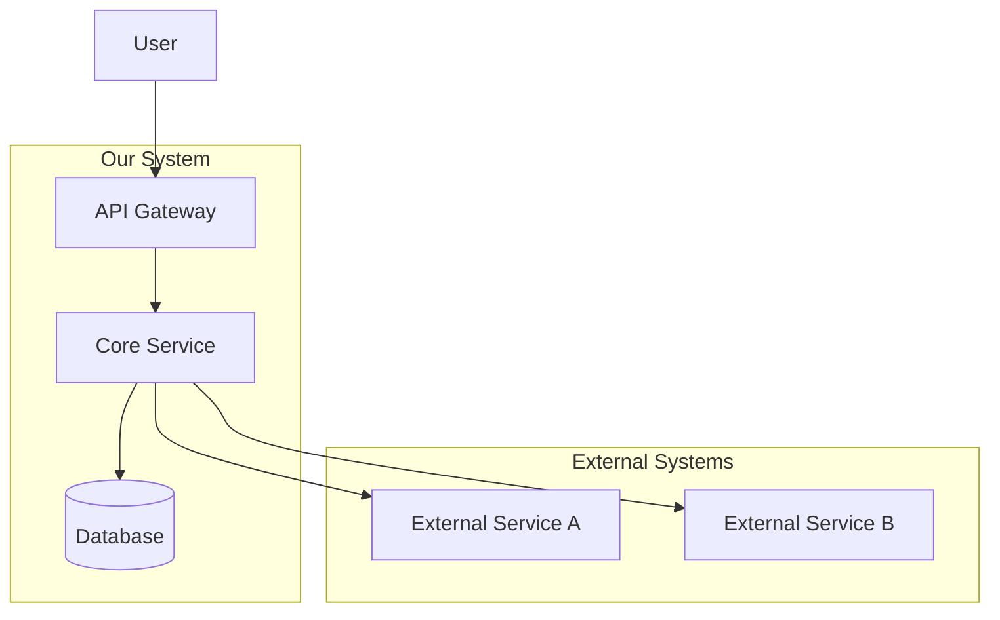
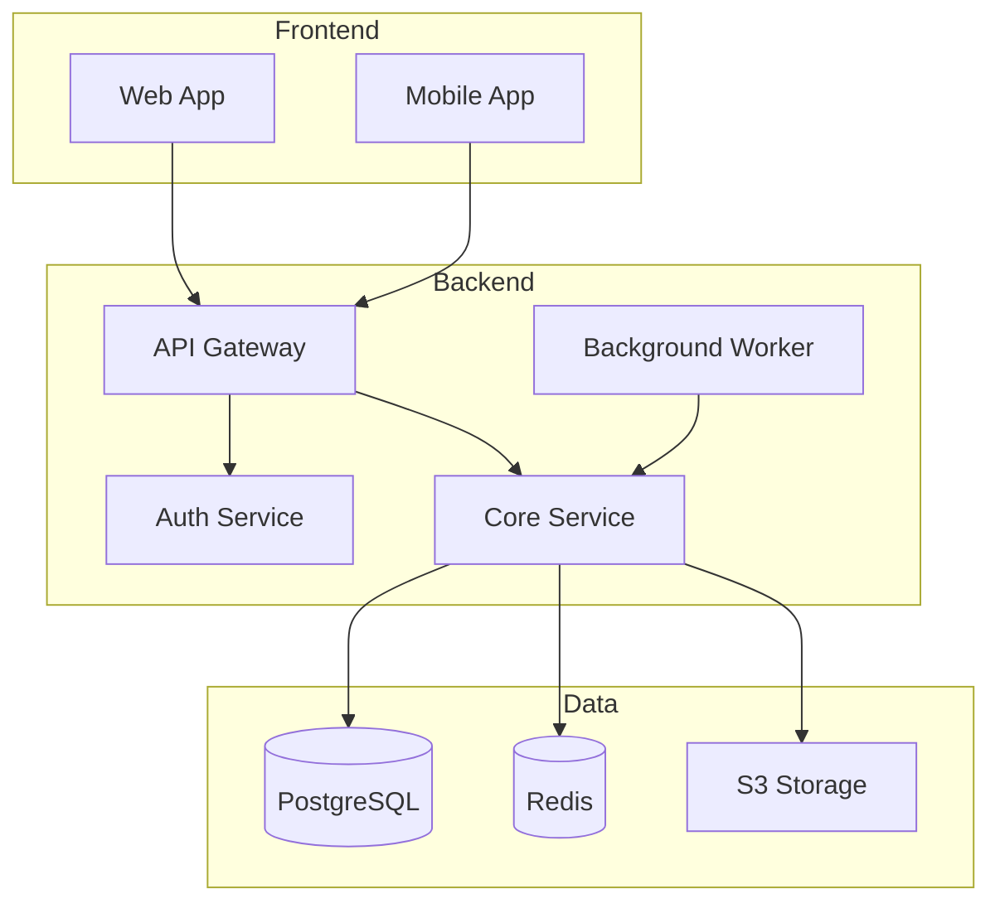

## Usage
```
/architecture [feature or system description]
/architecture diagram [description]   # Just diagrams
/architecture adr [decision]          # Architecture Decision Record
/architecture review [file/system]    # Review existing architecture
```

## Output Format

```markdown
# Architecture Design: [System/Feature Name]

## Overview
[High-level description of the architecture]

## System Context Diagram



## Component Diagram



## Components

### [Component Name]
| Attribute | Value |
|-----------|-------|
| **Purpose** | [What it does] |
| **Technology** | [Tech stack] |
| **Scaling** | [Scaling strategy] |
| **Dependencies** | [What it depends on] |

## Security Considerations

| Concern | Mitigation |
|---------|------------|
| Authentication | JWT tokens with refresh mechanism |
| Authorization | RBAC with fine-grained permissions |
| Data Protection | Encryption at rest and in transit |
| Input Validation | Schema validation on all inputs |

## Performance Requirements

| Metric | Target | Measurement |
|--------|--------|-------------|
| Response Time (p95) | < 200ms | API latency |
| Throughput | 1000 req/s | Sustained load |
| Availability | 99.9% | Uptime SLA |

## Decision Log
- [Date]: [Decision made and rationale]
```

## Related Skills
- `/api-design` - Detailed API contract design
- `/spec` - Feature specification
- `/implement` - Implement the architecture
