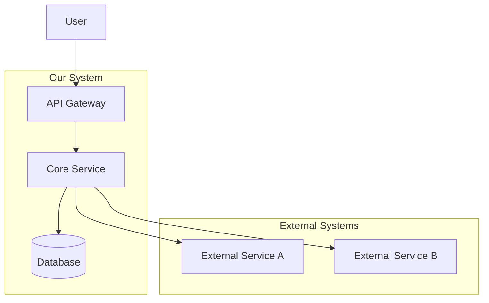
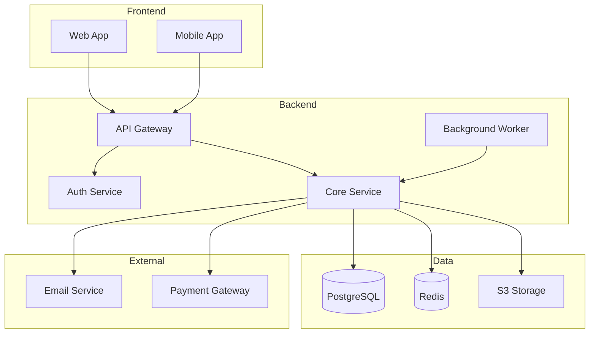
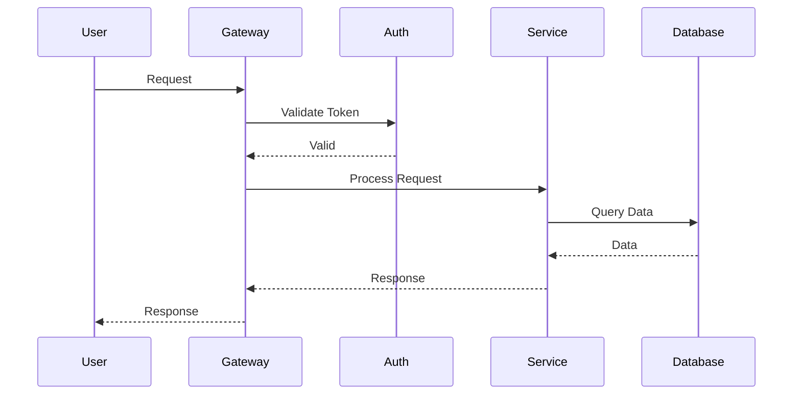
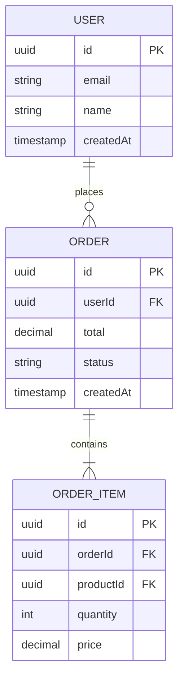
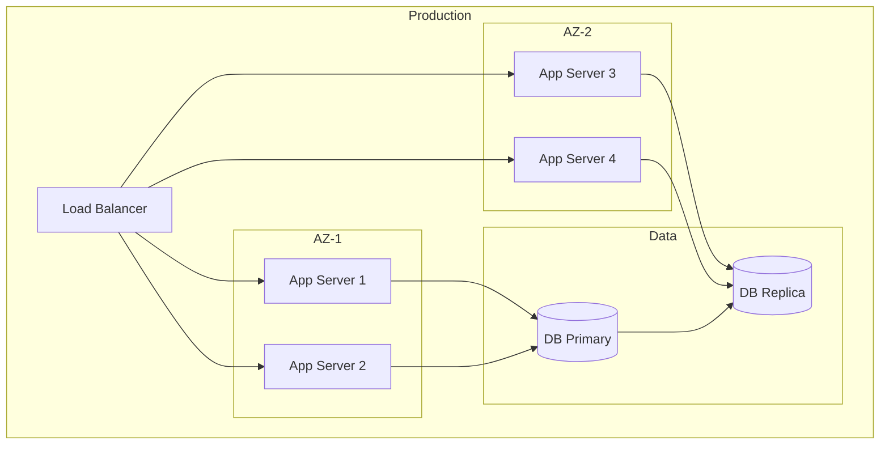

# Skill: /architecture - Generate Architecture Design

<command-name>architecture</command-name>

## Description
Creates comprehensive architecture documentation including system diagrams, component designs, and technical specifications. Uses the Architect Agent persona.

## Usage
```
/architecture [feature or system description]
```

## Options
```
/architecture [description]           # Full architecture design
/architecture diagram [description]   # Just diagrams
/architecture adr [decision]          # Architecture Decision Record
/architecture review [file/system]    # Review existing architecture
```

## Output Format

```markdown
# Architecture Design: [System/Feature Name]

## Overview
[High-level description of the architecture]

## System Context Diagram



## Component Diagram



## Data Flow Diagram



## Components

### [Component Name]
| Attribute | Value |
|-----------|-------|
| **Purpose** | [What it does] |
| **Technology** | [Tech stack] |
| **Scaling** | [Scaling strategy] |
| **Dependencies** | [What it depends on] |

**Responsibilities:**
- [Responsibility 1]
- [Responsibility 2]

**Interfaces:**
- `POST /api/resource` - Create resource
- `GET /api/resource/:id` - Get resource

## Data Model



## API Contracts

### Create Resource
```yaml
POST /api/v1/resources
Request:
  Content-Type: application/json
  Body:
    name: string (required)
    type: enum[A, B, C] (required)
    metadata: object (optional)

Response:
  201 Created:
    id: uuid
    name: string
    type: string
    createdAt: timestamp

  400 Bad Request:
    error: string
    details: object

  401 Unauthorized:
    error: "Authentication required"
```

## Security Considerations

| Concern | Mitigation |
|---------|------------|
| Authentication | JWT tokens with refresh mechanism |
| Authorization | RBAC with fine-grained permissions |
| Data Protection | Encryption at rest and in transit |
| Input Validation | Schema validation on all inputs |

## Performance Requirements

| Metric | Target | Measurement |
|--------|--------|-------------|
| Response Time (p95) | < 200ms | API latency |
| Throughput | 1000 req/s | Sustained load |
| Availability | 99.9% | Uptime SLA |

## Scalability

- **Horizontal**: Stateless services behind load balancer
- **Vertical**: Database read replicas
- **Caching**: Redis for frequently accessed data
- **Async**: Queue-based processing for heavy tasks

## Monitoring & Observability

### Metrics
- Request rate, latency, error rate
- Database query performance
- Cache hit ratio
- Queue depth

### Logging
- Structured JSON logs
- Request correlation IDs
- Log aggregation via [tool]

### Alerting
- Error rate > 1%
- Latency p95 > 500ms
- Queue depth > 1000

## Deployment Architecture



## Migration Strategy
[If applicable]

## Risks & Mitigations

| Risk | Probability | Impact | Mitigation |
|------|-------------|--------|------------|
| [Risk 1] | Medium | High | [Mitigation] |

## Decision Log
- [Date]: [Decision made and rationale]
```

## Related Skills
- `/api-design` - Detailed API contract design
- `/spec` - Feature specification
- `/implement` - Implement the architecture
