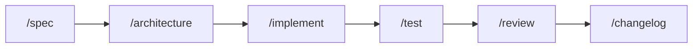
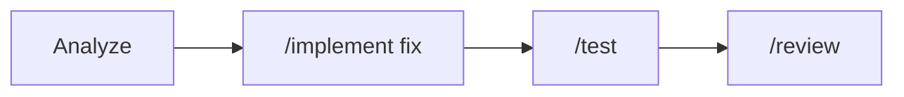

# AI Native SDLC Framework

An AI-native Software Development Lifecycle framework powered by Claude Code. This framework provides specialized agents, skills, and automation for every phase of development.

## Features

- **6 SDLC Phases**: Specify → Design → Develop → Validate → Release → Maintain
- **7 Specialized Agents**: PM, Architect, Frontend, Backend, QA, DevOps, Tech Writer
- **20+ Skills**: Task-specific commands for common workflows
- **Agent Teams**: Orchestrated multi-agent workflows
- **Templates**: Standardized outputs for consistency
- **MCP Integration**: Connect to external tools and services

## Quick Start

### Installation

#### New Repository
```bash
# Clone the framework
git clone https://github.com/chiragingale/ai-native-sdlc.git my-project
cd my-project

# Remove git history and reinitialize
rm -rf .git
git init

# Install Claude Code if not already installed
npm install -g @anthropic-ai/claude-code

# Start using the framework
claude
```

#### Existing Repository
```bash
# Navigate to your project
cd your-project

# Copy the framework files
curl -sL https://github.com/chiragingale/ai-native-sdlc/archive/main.tar.gz | tar -xz --strip=1 -C . ai-native-sdlc-main/.claude ai-native-sdlc-main/CLAUDE.md

# Or manually copy:
# 1. Copy .claude/ directory to your project root
# 2. Copy CLAUDE.md to your project root
# 3. Merge settings if you have existing .claude/settings.json

# Start using the framework
claude
```

## Usage

### Skills (Slash Commands)

| Phase | Skill | Description |
|-------|-------|-------------|
| **Specify** | `/spec` | Generate feature specification |
| | `/user-story` | Create user stories |
| | `/interview` | Interactive requirements gathering |
| **Design** | `/architecture` | Create architecture design |
| | `/api-design` | Design API contracts |
| **Develop** | `/implement` | Implement a feature |
| | `/refactor` | Refactor code |
| **Validate** | `/review` | Code review |
| | `/test` | Generate and run tests |
| **Release** | `/changelog` | Generate changelog |
| | `/deploy-checklist` | Pre-deployment validation |
| **Maintain** | `/tech-debt` | Analyze technical debt |

### Agent Teams

```bash
# Feature development (full workflow)
/team feature "Add user authentication"

# Bug fix
/team bugfix "Fix login redirect issue"

# Code review
/team review "PR #123"

# Release preparation
/team release "v2.0.0"
```

### Individual Agents

Agents are automatically activated based on context, or you can reference them directly:

```bash
# Use PM Agent
"As the PM Agent, create user stories for the checkout flow"

# Use Architect Agent
"As the Architect Agent, design the database schema"

# Use QA Agent
"As the QA Agent, review this code for security issues"
```

## Directory Structure

```
your-project/
├── .claude/
│   ├── settings.json          # Claude Code configuration
│   ├── agents/                # Agent definitions
│   │   ├── pm-agent.md
│   │   ├── architect-agent.md
│   │   ├── frontend-agent.md
│   │   ├── backend-agent.md
│   │   ├── qa-agent.md
│   │   ├── devops-agent.md
│   │   └── tech-writer-agent.md
│   ├── skills/                # Skill definitions
│   │   ├── specify/
│   │   ├── design/
│   │   ├── develop/
│   │   ├── validate/
│   │   ├── release/
│   │   └── maintain/
│   ├── templates/             # Output templates
│   ├── rules/                 # Project rules
│   └── examples/              # Reference examples
├── CLAUDE.md                  # Project context file
└── ... (your code)
```

## Configuration

### MCP Servers

Configure MCP servers in `.claude/settings.json`:

```json
{
  "mcpServers": {
    "github": {
      "command": "npx",
      "args": ["-y", "@modelcontextprotocol/server-github"],
      "env": {
        "GITHUB_TOKEN": "${GITHUB_TOKEN}"
      }
    },
    "jira": {
      "command": "npx",
      "args": ["-y", "mcp-server-jira"],
      "env": {
        "JIRA_URL": "${JIRA_URL}",
        "JIRA_TOKEN": "${JIRA_TOKEN}"
      }
    },
    "slack": {
      "command": "npx",
      "args": ["-y", "mcp-server-slack"],
      "env": {
        "SLACK_TOKEN": "${SLACK_TOKEN}"
      }
    }
  }
}
```

### Custom Rules

Add project-specific rules in `.claude/rules/`:

```markdown
<!-- .claude/rules/code-style.md -->
# Code Style Rules

- Use TypeScript for all new code
- Follow functional programming patterns where possible
- Maximum function length: 50 lines
- Required test coverage: 80%
```

### Custom Templates

Add custom templates in `.claude/templates/`:

```markdown
<!-- .claude/templates/pr-description.md -->
# Pull Request Template

## Summary
[What does this PR do?]

## Changes
- [ ] Change 1
- [ ] Change 2

## Testing
- [ ] Unit tests
- [ ] Integration tests

## Screenshots
[If applicable]
```

## Workflows

### Feature Development Workflow



1. **Specify**: `/spec Add user profile feature`
2. **Design**: `/architecture user profile system`
3. **Develop**: `/implement user profile based on spec`
4. **Test**: `/test src/features/profile`
5. **Review**: `/review staged`
6. **Release**: `/changelog`

### Bug Fix Workflow



1. **Analyze**: Describe the bug, get root cause analysis
2. **Fix**: `/implement fix for [bug description]`
3. **Test**: `/test` to add regression tests
4. **Review**: `/review` for code review

## Best Practices

### 1. Start with Specification
Always begin with a clear specification before implementation:
```bash
/spec [feature]
# or
/interview [feature area]
```

### 2. Use Agent Teams for Complex Tasks
For multi-step tasks, use agent teams:
```bash
/team feature "complex feature"
```

### 3. Review Before Commit
Always run code review before committing:
```bash
/review staged
```

### 4. Keep Skills Focused
Use specific skills rather than broad requests:
```bash
# Good
/implement Add pagination to user list

# Less effective
"Make the user list better"
```

### 5. Provide Context
Include relevant context in your requests:
```bash
/implement Add rate limiting (see architecture.md for design)
```

## Extending the Framework

### Adding Custom Skills

Create a new skill file in `.claude/skills/[phase]/`:

```markdown
# Skill: /my-skill - Description

<command-name>my-skill</command-name>

## Description
[What this skill does]

## Usage
\`\`\`
/my-skill [arguments]
\`\`\`

## Output Format
[Expected output]
```

### Adding Custom Agents

Create a new agent file in `.claude/agents/`:

```markdown
# Custom Agent Name

## Role
[Agent's role and expertise]

## Responsibilities
- [Responsibility 1]
- [Responsibility 2]

## Output Formats
[Templates for this agent's outputs]

## Collaboration
[How this agent works with others]
```

## Troubleshooting

### Skills Not Working
1. Ensure `.claude/skills/` directory exists
2. Check skill file has correct `<command-name>` tag
3. Restart Claude Code session

### Agents Not Recognized
1. Verify agent files are in `.claude/agents/`
2. Check CLAUDE.md references agents correctly
3. Ensure agent file uses correct format

### MCP Servers Not Connecting
1. Verify environment variables are set
2. Check MCP server is installed
3. Review settings.json configuration

## Contributing

1. Fork the repository
2. Create your feature branch
3. Add/modify skills, agents, or templates
4. Submit a pull request

## License

MIT License - See LICENSE file for details

## Support

- [Documentation](https://github.com/chiragingale/ai-native-sdlc/wiki)
- [Issues](https://github.com/chiragingale/ai-native-sdlc/issues)
- [Discussions](https://github.com/chiragingale/ai-native-sdlc/discussions)
